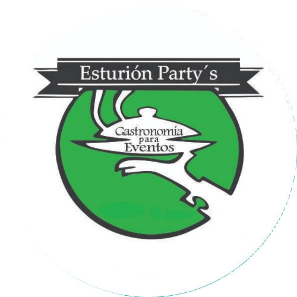

<h1 align="center">
   
  
   
  Esturión Party's
   
</h1>

<h4 align="center">This website help to manage and make visible a family business of a friend who is dedicated to event catering</a></h4>

<a href="https://www.youtube.com/watch?v=2U_yRmmS5EU">Video Demo</a>

  <a href="#key-features">Key Features</a> •
  <a href="#future-improvements">Future Improvements</a> •
  <a href="#credits">Credits</a> •
  <a href="#related">Related</a> •
  <a href="#license-considerations">License Considerations</a> •
  <a href="#authors">Authors</a>

## Key Features

* Two types of views/accesses, the guest view and the administrator/staff view
  - For administrator/staff view need to login.
* Guest access
  - Home page
  - Service section
  - Form section
* Staff access
  - Same access as guests
  - Agenda section
  - Queries section
  - Inventory section
  - Profile section
* Administrator access
  - Same access as staff
  - Users section
* Service section view a brief description of services offered
* Form section let guests to ask details about any service offered via email
* Agenda section let administrator/staff view available dates via embedded calendar
* Queries section let administrator/staff answer guests queries via email
* Inventory section let administrator/staff manage, modify or add product to inventory
* Profile section let user to change password
* Users section let administrator to view, manage or add new users/staff

## Future Improvements

* Implement security measures
* Deploy to server
* Send confirmation emails when password is changed
* Send confirmation emails when a new user is created
* Implement API for email management
   - View emails
   - Send emails
* Implement API for calendar management
   - View events
   - Create events
   - Modify events
   - Delete events
* Delete users
* Remove inventory items
* Add images of the business

## Credits

This software uses resources from the following pages:

- Images are taken from [Pexels](https://pexels.com/es-ES/license/)
- [README Templates](https://www.readme-templates.com/)

## Related

Final Project [CS50x](https://www.edx.org/es/learn/computer-science/harvard-university-cs50-s-introduction-to-computer-science?linked_from=autocomplete-prequery&c=autocomplete-prequery&position=1)

## License Considerations
Original business logo

## Authors
[Yazmin Trucido](https://github.com/YazminTrucido)

